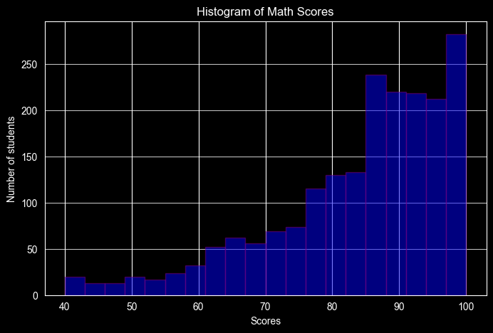
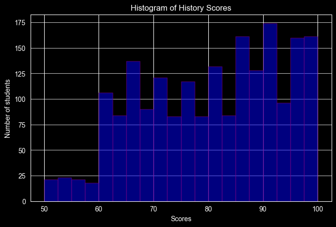
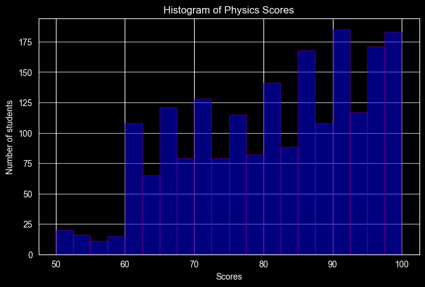
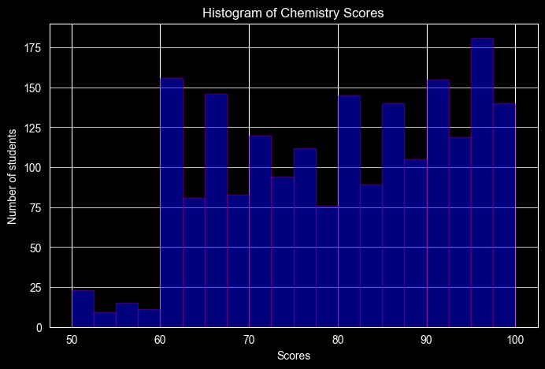
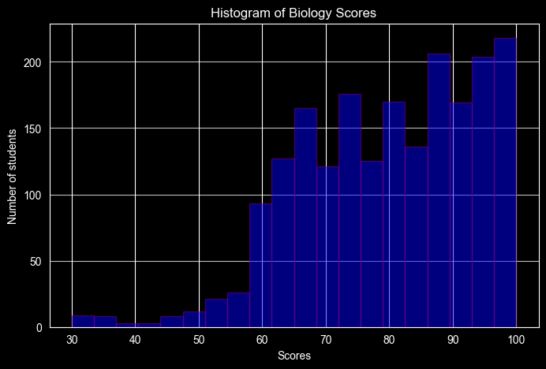
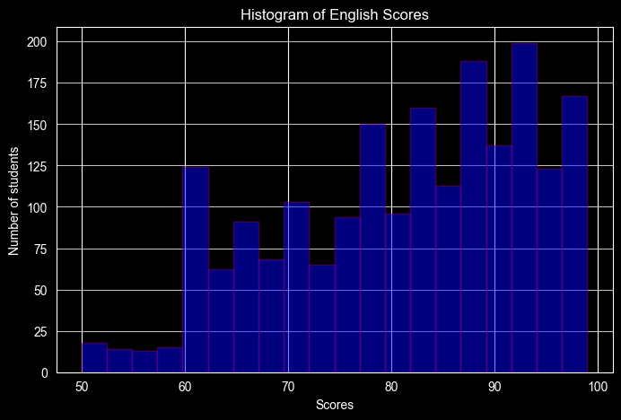
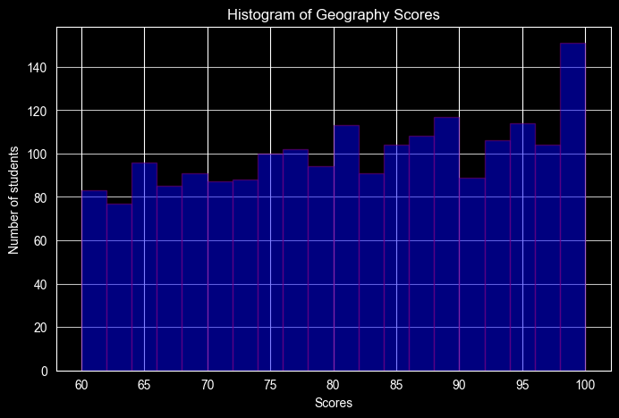
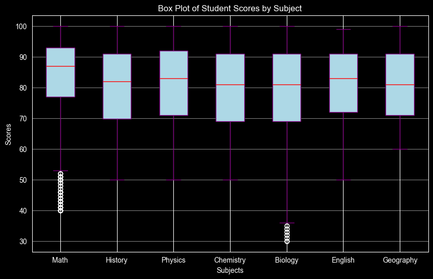

## PDA03 Module 8.1: Exploring Student Performance Data Analysis Assignment

### Task 0: Create the student performance dataset


```python
# Not required because it has already been provided

# '''
# # Run the code to generate the file
# np.random.seed(0)
# num_samples = 1000
#
# # Generate random scores between 0 and 100 for each subject
# math_scores = np.random.randint(0, 101, num_samples)
# science_scores = np.random.randint(0, 101, num_samples)
# english_scores = np.random.randint(0, 101, num_samples)
#
# # Create a DataFrame
# df = pd.DataFrame(
#     {
# 'Math': math_scores,
# 'Science': science_scores,
# 'English': english_scores
# })
#
# # Save the DataFrame to a CSV file
# df.to_csv('student_performance.csv', index=False)
# '''
```

### Task 1: Import the necessary libraries


```python
import pandas as pd
import numpy as np
import matplotlib.pyplot as plt
```

### Task 2: Load the dataset


```python
# Use Pandas to read the provided CSV file
df = pd.read_csv('.\\sample_data\\student_scores_2000_rows.csv')
df.head()
```


<div>
<style scoped>
    .dataframe tbody tr th:only-of-type {
        vertical-align: middle;
    }

    .dataframe tbody tr th {
        vertical-align: top;
    }

    .dataframe thead th {
        text-align: right;
    }
</style>
<table border="1" class="dataframe">
  <thead>
    <tr style="text-align: right;">
      <th></th>
      <th>id</th>
      <th>first_name</th>
      <th>last_name</th>
      <th>email</th>
      <th>gender</th>
      <th>part_time_job</th>
      <th>absence_days</th>
      <th>extracurricular_activities</th>
      <th>weekly_self_study_hours</th>
      <th>career_aspiration</th>
      <th>math_score</th>
      <th>history_score</th>
      <th>physics_score</th>
      <th>chemistry_score</th>
      <th>biology_score</th>
      <th>english_score</th>
      <th>geography_score</th>
    </tr>
  </thead>
  <tbody>
    <tr>
      <th>0</th>
      <td>1</td>
      <td>Paul</td>
      <td>Casey</td>
      <td>paul.casey.1@gslingacademy.com</td>
      <td>male</td>
      <td>False</td>
      <td>3</td>
      <td>False</td>
      <td>27</td>
      <td>Lawyer</td>
      <td>73</td>
      <td>81</td>
      <td>93</td>
      <td>97</td>
      <td>63</td>
      <td>80</td>
      <td>87</td>
    </tr>
    <tr>
      <th>1</th>
      <td>2</td>
      <td>Danielle</td>
      <td>Sandoval</td>
      <td>danielle.sandoval.2@gslingacademy.com</td>
      <td>female</td>
      <td>False</td>
      <td>2</td>
      <td>False</td>
      <td>47</td>
      <td>Doctor</td>
      <td>90</td>
      <td>86</td>
      <td>96</td>
      <td>100</td>
      <td>90</td>
      <td>88</td>
      <td>90</td>
    </tr>
    <tr>
      <th>2</th>
      <td>3</td>
      <td>Tina</td>
      <td>Andrews</td>
      <td>tina.andrews.3@gslingacademy.com</td>
      <td>female</td>
      <td>False</td>
      <td>9</td>
      <td>True</td>
      <td>13</td>
      <td>Government Officer</td>
      <td>81</td>
      <td>97</td>
      <td>95</td>
      <td>96</td>
      <td>65</td>
      <td>77</td>
      <td>94</td>
    </tr>
    <tr>
      <th>3</th>
      <td>4</td>
      <td>Tara</td>
      <td>Clark</td>
      <td>tara.clark.4@gslingacademy.com</td>
      <td>female</td>
      <td>False</td>
      <td>5</td>
      <td>False</td>
      <td>3</td>
      <td>Artist</td>
      <td>71</td>
      <td>74</td>
      <td>88</td>
      <td>80</td>
      <td>89</td>
      <td>63</td>
      <td>86</td>
    </tr>
    <tr>
      <th>4</th>
      <td>5</td>
      <td>Anthony</td>
      <td>Campos</td>
      <td>anthony.campos.5@gslingacademy.com</td>
      <td>male</td>
      <td>False</td>
      <td>5</td>
      <td>False</td>
      <td>10</td>
      <td>Unknown</td>
      <td>84</td>
      <td>77</td>
      <td>65</td>
      <td>65</td>
      <td>80</td>
      <td>74</td>
      <td>76</td>
    </tr>
  </tbody>
</table>
</div>


```python
# Convert the DataFrame to a NumPy array for numerical analysis
scores_array = df.to_numpy()
scores_array
```


    array([[1, 'Paul', 'Casey', ..., 63, 80, 87],
           [2, 'Danielle', 'Sandoval', ..., 90, 88, 90],
           [3, 'Tina', 'Andrews', ..., 65, 77, 94],
           ...,
           [1998, 'Madison', 'Cross', ..., 68, 94, 78],
           [1999, 'Brittany', 'Compton', ..., 95, 88, 75],
           [2000, 'Natalie', 'Smith', ..., 83, 93, 100]],
          shape=(2000, 17), dtype=object)


### Task 3: Data cleaning


```python
# Check for any missing or null values and handle them appropriately
df.isnull().sum()
```


    id                            0
    first_name                    0
    last_name                     0
    email                         0
    gender                        0
    part_time_job                 0
    absence_days                  0
    extracurricular_activities    0
    weekly_self_study_hours       0
    career_aspiration             0
    math_score                    0
    history_score                 0
    physics_score                 0
    chemistry_score               0
    biology_score                 0
    english_score                 0
    geography_score               0
    dtype: int64


```python
missing_values = df.isnull().sum().sum()

if missing_values == 0:
    print("*** No missing values found ***")
else:
    print(f"*** {missing_values} missing value(s) found. Please handle appropriately ***")

```

    *** No missing values found ***
    


```python
# There are no missing values

# If there were any missing values, we could handle them either by filling them with the mean/median or by dropping the rows with missing values

# We can proceed to ensure all data types are correct
print(df.dtypes)
```

    id                             int64
    first_name                    object
    last_name                     object
    email                         object
    gender                        object
    part_time_job                   bool
    absence_days                   int64
    extracurricular_activities      bool
    weekly_self_study_hours        int64
    career_aspiration             object
    math_score                     int64
    history_score                  int64
    physics_score                  int64
    chemistry_score                int64
    biology_score                  int64
    english_score                  int64
    geography_score                int64
    dtype: object
    


```python
# Ensure all data types are correct (scores should be numeric)
df_scores = df[[col for col in df.columns if "score" in col]]

if df_scores.dtypes.eq('int64').all():
    print("*** All data types are correct ***")
else:
    print("*** Data type issues found. Please ensure all scores are numeric ***")
```

    *** All data types are correct ***
    


```python
# If there were any non-numeric data types for the scores, we could convert them to numeric using pd.to_numeric() or handle them accordingly

# After handling any missing values and non-numeric data types, it would then also be necessary to again convert the DataFrame to a NumPy array for numerical analysis
scores_array = df_scores.to_numpy()
scores_array
```


    array([[ 73,  81,  93, ...,  63,  80,  87],
           [ 90,  86,  96, ...,  90,  88,  90],
           [ 81,  97,  95, ...,  65,  77,  94],
           ...,
           [ 97,  85,  63, ...,  68,  94,  78],
           [ 51,  96,  72, ...,  95,  88,  75],
           [ 82,  99,  91, ...,  83,  93, 100]], shape=(2000, 7))


### Task 4: Exploratory data analysis (EDA)


```python
# Now the dataset is clean and ready for analysis

# Calculate descriptive statistics for each subject: mean, median, mode, range, variance, and standard deviation

# This can be done using the describe() method of Pandas DataFrame

summary_stats = df_scores.describe()
print(summary_stats)

for col in summary_stats.columns:
    mean_val = df_scores[col].mean()
    median_val = df_scores[col].median()
    mode_val = df_scores[col].mode().iloc[0]
    range_val = df_scores[col].max() - df_scores[col].min()
    variance_val = df_scores[col].var()
    std_val = df_scores[col].std()

    print("\n")
    print(f"Descriptive statistics for {col}:")
    print(f"Mean: {mean_val}")
    print(f"Median: {median_val}")
    print(f"Mode: {mode_val}")
    print(f"Range: {range_val}")
    print(f"Variance: {variance_val}")
    print(f"Standard deviation: {std_val}")

# Determine the subject with the highest variance in scores
highest_variance_subject = df_scores.var().idxmax()
print("\n")
print(f"The subject with the highest variance in scores is: {highest_variance_subject}"
      f"\nWith a variance of: {df_scores.var().max()}")

```

            math_score  history_score  physics_score  chemistry_score  \
    count  2000.000000    2000.000000    2000.000000      2000.000000   
    mean     83.452000      80.332000      81.336500        79.995000   
    std      13.224906      12.736046      12.539453        12.777895   
    min      40.000000      50.000000      50.000000        50.000000   
    25%      77.000000      69.750000      71.000000        69.000000   
    50%      87.000000      82.000000      83.000000        81.000000   
    75%      93.000000      91.000000      92.000000        91.000000   
    max     100.000000     100.000000     100.000000       100.000000   
    
           biology_score  english_score  geography_score  
    count     2000.00000    2000.000000      2000.000000  
    mean        79.58150      81.277500        80.888000  
    std         13.72219      12.027087        11.637705  
    min         30.00000      50.000000        60.000000  
    25%         69.00000      72.000000        71.000000  
    50%         81.00000      83.000000        81.000000  
    75%         91.00000      91.000000        91.000000  
    max        100.00000      99.000000       100.000000  
    
    
    Descriptive statistics for math_score:
    Mean: 83.452
    Median: 87.0
    Mode: 99
    Range: 60
    Variance: 174.89814507253627
    Standard deviation: 13.22490624059529
    
    
    Descriptive statistics for history_score:
    Mean: 80.332
    Median: 82.0
    Mode: 88
    Range: 50
    Variance: 162.20687943971987
    Standard deviation: 12.736046460331396
    
    
    Descriptive statistics for physics_score:
    Mean: 81.3365
    Median: 83.0
    Mode: 96
    Range: 50
    Variance: 157.23788669334667
    Standard deviation: 12.539453205516844
    
    
    Descriptive statistics for chemistry_score:
    Mean: 79.995
    Median: 81.0
    Mode: 94
    Range: 50
    Variance: 163.27461230615307
    Standard deviation: 12.777895456848638
    
    
    Descriptive statistics for biology_score:
    Mean: 79.5815
    Median: 81.0
    Mode: 100
    Range: 70
    Variance: 188.29850700350178
    Standard deviation: 13.722190313630758
    
    
    Descriptive statistics for english_score:
    Mean: 81.2775
    Median: 83.0
    Mode: 90
    Range: 49
    Variance: 144.65081915957978
    Standard deviation: 12.027086894156032
    
    
    Descriptive statistics for geography_score:
    Mean: 80.888
    Median: 81.0
    Mode: 88
    Range: 40
    Variance: 135.43617408704353
    Standard deviation: 11.6377048461904
    
    
    The subject with the highest variance in scores is: biology_score
    With a variance of: 188.29850700350178
    


```python
# Calculate descriptive statistics for each subject: mean, median, mode, range, variance, and standard deviation

# This can also be done using NumPy functions directly on the NumPy array

means = np.mean(scores_array, axis=0)
medians = np.median(scores_array, axis=0)

# NumPy doesn't have a mode function, but SciPy does, and it can operate on a NumPy array
from scipy import stats
modes = stats.mode(scores_array, axis=0)[0]

ranges = np.ptp(scores_array, axis=0)
variances = np.var(scores_array, axis=0)
stds = np.std(scores_array, axis=0)

desc_stats_dict = {
    'subject': df_scores.columns.to_numpy(),
    'mean': means,
    'median': medians,
    'mode': modes,
    'range':ranges,
    'variance': variances,
    'std': stds}

for i, subject in enumerate(desc_stats_dict['subject']):
    print("\n")
    print(f"Descriptive statistics for {subject}:")
    print(f"Mean: {desc_stats_dict['mean'][i]}")
    print(f"Median: {desc_stats_dict['median'][i]}")
    print(f"Mode: {desc_stats_dict['mode'][i]}")
    print(f"Range: {desc_stats_dict['range'][i]}")
    print(f"Variance: {desc_stats_dict['variance'][i]}")
    print(f"Standard deviation: {desc_stats_dict['std'][i]}")

# Determine the subject with the highest variance in scores
numpy_highest_variance_subject = desc_stats_dict['subject'][np.argmax(desc_stats_dict['variance'])]
print("\n")
print(f"The subject with the highest variance in scores is: {numpy_highest_variance_subject}"
      f"\nWith a variance of: {np.max(desc_stats_dict['variance'])}")
```

    
    
    Descriptive statistics for math_score:
    Mean: 83.452
    Median: 87.0
    Mode: 99
    Range: 60
    Variance: 174.810696
    Standard deviation: 13.22159960065347
    
    
    Descriptive statistics for history_score:
    Mean: 80.332
    Median: 82.0
    Mode: 88
    Range: 50
    Variance: 162.125776
    Standard deviation: 12.73286205061533
    
    
    Descriptive statistics for physics_score:
    Mean: 81.3365
    Median: 83.0
    Mode: 96
    Range: 50
    Variance: 157.15926775
    Standard deviation: 12.536317950259559
    
    
    Descriptive statistics for chemistry_score:
    Mean: 79.995
    Median: 81.0
    Mode: 94
    Range: 50
    Variance: 163.19297500000002
    Standard deviation: 12.774700583575335
    
    
    Descriptive statistics for biology_score:
    Mean: 79.5815
    Median: 81.0
    Mode: 100
    Range: 70
    Variance: 188.20435775
    Standard deviation: 13.718759337126663
    
    
    Descriptive statistics for english_score:
    Mean: 81.2775
    Median: 83.0
    Mode: 90
    Range: 49
    Variance: 144.57849375
    Standard deviation: 12.024079746492037
    
    
    Descriptive statistics for geography_score:
    Mean: 80.888
    Median: 81.0
    Mode: 88
    Range: 40
    Variance: 135.368456
    Standard deviation: 11.634795056209628
    
    
    The subject with the highest variance in scores is: biology_score
    With a variance of: 188.20435775
    


```python
# Compare the descriptive statistics obtained from Pandas and NumPy

# This can be done by comparing the values obtained from both methods for each statistic and subject

for i, subject in enumerate(desc_stats_dict['subject']):
    print("\n")

    print(f"Comparing descriptive statistics for {subject}:")

    print(f"Mean: Pandas = {summary_stats.loc['mean', subject]}, "
          f"NumPy = {desc_stats_dict['mean'][i]}")

    print(f"Median: Pandas = {summary_stats.loc['50%', subject]}, "
          f"NumPy = {desc_stats_dict['median'][i]}")

    print(f"Mode: Pandas = {df_scores[subject].mode().iloc[0]}, "
          f"NumPy = {desc_stats_dict['mode'][i]}")

    print(f"Range: Pandas = {summary_stats.loc['max', subject] - summary_stats.loc['min', subject]}, "
          f"NumPy = {desc_stats_dict['range'][i]}")

    print(f"Variance: Pandas = {df_scores[subject].var()}, "
          f"NumPy = {desc_stats_dict['variance'][i]}")

    print(f"Standard deviation: Pandas = {summary_stats.loc['std', subject]}, "
          f"NumPy = {desc_stats_dict['std'][i]}")

# The values obtained from both methods should match closely, confirming the consistency of the descriptive statistics calculated using Pandas and NumPy

# Variance and standard deviation values may differ slightly due to the default degrees of freedom used in Pandas (ddof=1) vs NumPy (ddof=0)

# To ensure they match, we can specify ddof=1 in the NumPy calculations for variance and standard deviation
```

    
    
    Comparing descriptive statistics for math_score:
    Mean: Pandas = 83.452, NumPy = 83.452
    Median: Pandas = 87.0, NumPy = 87.0
    Mode: Pandas = 99, NumPy = 99
    Range: Pandas = 60.0, NumPy = 60
    Variance: Pandas = 174.89814507253627, NumPy = 174.810696
    Standard deviation: Pandas = 13.22490624059529, NumPy = 13.22159960065347
    
    
    Comparing descriptive statistics for history_score:
    Mean: Pandas = 80.332, NumPy = 80.332
    Median: Pandas = 82.0, NumPy = 82.0
    Mode: Pandas = 88, NumPy = 88
    Range: Pandas = 50.0, NumPy = 50
    Variance: Pandas = 162.20687943971987, NumPy = 162.125776
    Standard deviation: Pandas = 12.736046460331396, NumPy = 12.73286205061533
    
    
    Comparing descriptive statistics for physics_score:
    Mean: Pandas = 81.3365, NumPy = 81.3365
    Median: Pandas = 83.0, NumPy = 83.0
    Mode: Pandas = 96, NumPy = 96
    Range: Pandas = 50.0, NumPy = 50
    Variance: Pandas = 157.23788669334667, NumPy = 157.15926775
    Standard deviation: Pandas = 12.539453205516844, NumPy = 12.536317950259559
    
    
    Comparing descriptive statistics for chemistry_score:
    Mean: Pandas = 79.995, NumPy = 79.995
    Median: Pandas = 81.0, NumPy = 81.0
    Mode: Pandas = 94, NumPy = 94
    Range: Pandas = 50.0, NumPy = 50
    Variance: Pandas = 163.27461230615307, NumPy = 163.19297500000002
    Standard deviation: Pandas = 12.777895456848638, NumPy = 12.774700583575335
    
    
    Comparing descriptive statistics for biology_score:
    Mean: Pandas = 79.5815, NumPy = 79.5815
    Median: Pandas = 81.0, NumPy = 81.0
    Mode: Pandas = 100, NumPy = 100
    Range: Pandas = 70.0, NumPy = 70
    Variance: Pandas = 188.29850700350178, NumPy = 188.20435775
    Standard deviation: Pandas = 13.722190313630758, NumPy = 13.718759337126663
    
    
    Comparing descriptive statistics for english_score:
    Mean: Pandas = 81.2775, NumPy = 81.2775
    Median: Pandas = 83.0, NumPy = 83.0
    Mode: Pandas = 90, NumPy = 90
    Range: Pandas = 49.0, NumPy = 49
    Variance: Pandas = 144.65081915957978, NumPy = 144.57849375
    Standard deviation: Pandas = 12.027086894156032, NumPy = 12.024079746492037
    
    
    Comparing descriptive statistics for geography_score:
    Mean: Pandas = 80.888, NumPy = 80.888
    Median: Pandas = 81.0, NumPy = 81.0
    Mode: Pandas = 88, NumPy = 88
    Range: Pandas = 40.0, NumPy = 40
    Variance: Pandas = 135.43617408704353, NumPy = 135.368456
    Standard deviation: Pandas = 11.6377048461904, NumPy = 11.634795056209628
    

### Task 5: Data visualisation


```python
# Plot histograms for each subject to visualise the score distributions
subjects = df_scores.columns
for subject in subjects:
    plt.figure(figsize=(8, 5))
    plt.hist(df_scores[subject], alpha=0.5, bins=20, label=subject, edgecolor='purple', color='blue')
    subject_string = str.split(subject, "_")[0].capitalize()
    plt.title(f'Histogram of {subject_string} Scores')
    plt.xlabel('Scores')
    plt.ylabel('Number of students')
    plt.grid(axis='y', alpha=0.75)
    plt.show()
```


    

    


    

    


    

    


    

    


    

    


    

    


    

    


```python
# Create a box plot to compare the score distributions across the subjects
subjects = df_scores.columns
pretty_subjects = [str.split(subject, "_")[0].capitalize() for subject in subjects]
plt.figure(figsize=(10, 6))
plt.boxplot([df_scores[subject] for subject in subjects],
            tick_labels=pretty_subjects,
            patch_artist=True,
            boxprops=dict(facecolor='lightblue', color='purple'),
            medianprops=dict(color='red'), whiskerprops=dict(color='purple'), capprops=dict(color='purple'))
plt.title('Box Plot of Student Scores by Subject')
plt.xlabel('Subjects')
plt.ylabel('Scores')
plt.grid(axis='y', alpha=0.5)
plt.show()
```


    

    


### Task 6: Correlation analysis between subjects


```python
# Calculate the correlation matrix to understand the relationships between scores in different subjects

# This can be done using the corr() method of Pandas DataFrame
pandas_correlation_matrix = df_scores.corr()
pandas_correlation_matrix = pandas_correlation_matrix.round(8)
print(pandas_correlation_matrix)
```

                     math_score  history_score  physics_score  chemistry_score  \
    math_score         1.000000       0.147247       0.115719         0.127131   
    history_score      0.147247       1.000000       0.048478         0.121498   
    physics_score      0.115719       0.048478       1.000000         0.126163   
    chemistry_score    0.127131       0.121498       0.126163         1.000000   
    biology_score      0.081298       0.088502       0.132280         0.119992   
    english_score      0.134831       0.147193       0.054314         0.068341   
    geography_score    0.049672       0.065751       0.103126         0.065430   
    
                     biology_score  english_score  geography_score  
    math_score            0.081298       0.134831         0.049672  
    history_score         0.088502       0.147193         0.065751  
    physics_score         0.132280       0.054314         0.103126  
    chemistry_score       0.119992       0.068341         0.065430  
    biology_score         1.000000       0.074227         0.106526  
    english_score         0.074227       1.000000         0.072250  
    geography_score       0.106526       0.072250         1.000000  
    


```python
# This can also be done using the np.corrcoef() method of NumPy on the NumPy array
numpy_correlation_matrix = np.corrcoef(scores_array, rowvar=False)
numpy_correlation_matrix = np.round(numpy_correlation_matrix, 8)
numpy_correlation_matrix
```


    array([[1.        , 0.14724747, 0.11571874, 0.12713149, 0.08129806,
            0.13483078, 0.04967233],
           [0.14724747, 1.        , 0.04847843, 0.12149786, 0.08850197,
            0.14719288, 0.06575135],
           [0.11571874, 0.04847843, 1.        , 0.1261628 , 0.13227971,
            0.0543137 , 0.10312592],
           [0.12713149, 0.12149786, 0.1261628 , 1.        , 0.11999168,
            0.06834058, 0.06543008],
           [0.08129806, 0.08850197, 0.13227971, 0.11999168, 1.        ,
            0.07422691, 0.10652591],
           [0.13483078, 0.14719288, 0.0543137 , 0.06834058, 0.07422691,
            1.        , 0.07224979],
           [0.04967233, 0.06575135, 0.10312592, 0.06543008, 0.10652591,
            0.07224979, 1.        ]])


```python
# Print the correlation matrix to understand the relationships between scores in different subjects
subjects = df_scores.columns

for i in range(len(subjects)):
    for j in range(i + 1, len(subjects)):
        print(f"{subjects[i]} ↔ {subjects[j]}:"
              f" {numpy_correlation_matrix[i, j]:.8f}")
```

    math_score ↔ history_score: 0.14724747
    math_score ↔ physics_score: 0.11571874
    math_score ↔ chemistry_score: 0.12713149
    math_score ↔ biology_score: 0.08129806
    math_score ↔ english_score: 0.13483078
    math_score ↔ geography_score: 0.04967233
    history_score ↔ physics_score: 0.04847843
    history_score ↔ chemistry_score: 0.12149786
    history_score ↔ biology_score: 0.08850197
    history_score ↔ english_score: 0.14719288
    history_score ↔ geography_score: 0.06575135
    physics_score ↔ chemistry_score: 0.12616280
    physics_score ↔ biology_score: 0.13227971
    physics_score ↔ english_score: 0.05431370
    physics_score ↔ geography_score: 0.10312592
    chemistry_score ↔ biology_score: 0.11999168
    chemistry_score ↔ english_score: 0.06834058
    chemistry_score ↔ geography_score: 0.06543008
    biology_score ↔ english_score: 0.07422691
    biology_score ↔ geography_score: 0.10652591
    english_score ↔ geography_score: 0.07224979
    
